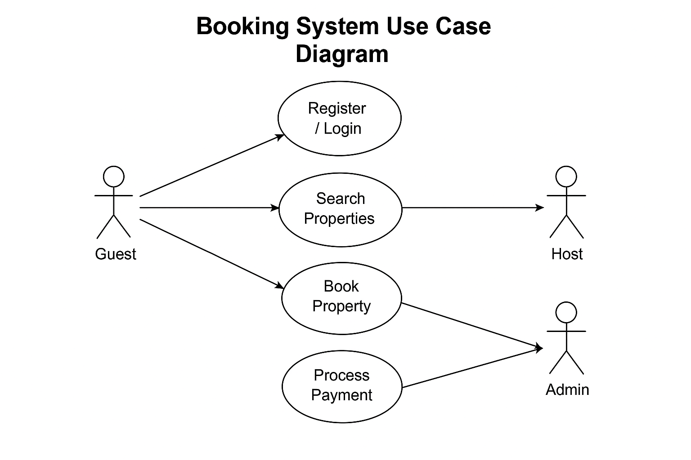

# requirement-analysis
This repository serves as a foundation for understanding and executing the Requirement Analysis phase of the Software Development Lifecycle (SDLC). It focuses on documenting and structuring requirements for a booking management system, simulating a real-world scenario for hands-on learning.

1. Define Requirement Analysis
What is Requirement Analysis?

Requirement Analysis is the process of gathering, analyzing, and documenting the requirements of a software system. It helps identify the needs of stakeholders and translates them into detailed specifications that guide the development process. In the SDLC, this phase ensures that the final product meets user expectations and aligns with business goals.

2. Importance of Requirement Analysis
Why is Requirement Analysis Important?

1. Establishes Clear Scope: Helps define what should be built, reducing ambiguity.
2. Prevents Costly Rework: Early clarification of requirements minimizes changes during development.
3. Improves Stakeholder Communication: Acts as a bridge between developers and stakeholders by setting mutual expectations.

3.  Key Activities in Requirement Analysis
Key Activities in Requirement Analysis

- Requirement Gathering: Collecting initial inputs from stakeholders through interviews, questionnaires, and observations.
- Requirement Elicitation: Refining the collected requirements using techniques like brainstorming, prototyping, or workshops.
- Requirement Documentation: Structuring requirements into formal documents like SRS, use cases, and diagrams.
- Requirement Analysis and Modeling: Analyzing dependencies, feasibility, and creating models like use case diagrams or ERDs.
- Requirement Validation: Reviewing requirements with stakeholders to ensure accuracy and completeness.

4. Types of Requirements
Types of Requirements

Functional Requirements
Functional requirements define specific behavior or functions. Examples for a booking management system:
- User registration and login
- Property listing
- Booking a property
- Payment integration

Non-functional Requirements
Non-functional requirements define system performance and constraints. Examples include:
- The website should load in under 3 seconds
- The system must support up to 10,000 users concurrently
- Data must be encrypted in transit and at rest

5. Create a Use Case Diagram Example
Use Case Diagrams

Use Case Diagrams help visualize interactions between users (actors) and the system. They show what actions different roles can perform and how the system responds.

 6. Define Acceptance Criteria
 Acceptance Criteria

Acceptance Criteria define the conditions a feature must meet to be accepted by stakeholders. They ensure the development team delivers what’s expected.

Importance:
- Guides development and testing
- Sets expectations with stakeholders
- Prevents scope creep

Example: Checkout Feature

- Given a logged-in user with an active booking,
- When the user proceeds to checkout and provides valid payment details,
- Then the system must confirm payment and mark the booking as complete.
